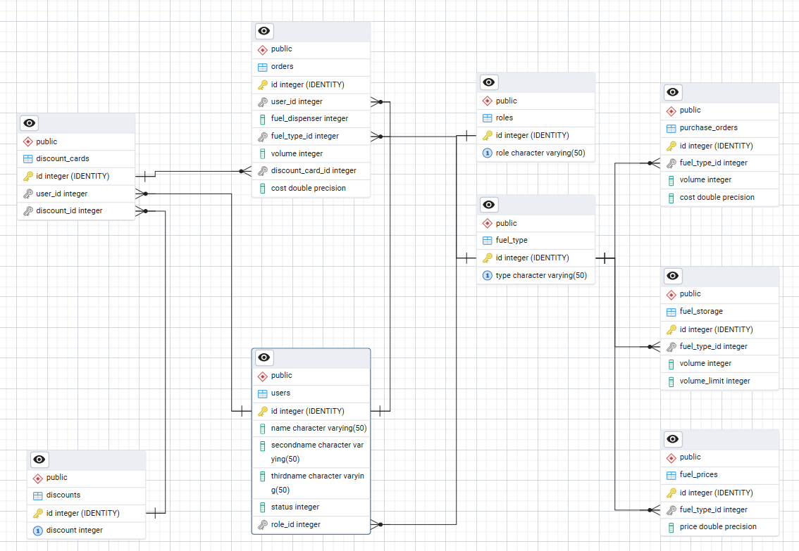
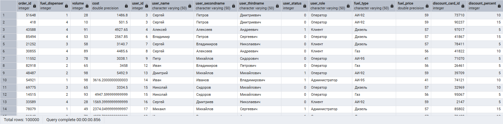
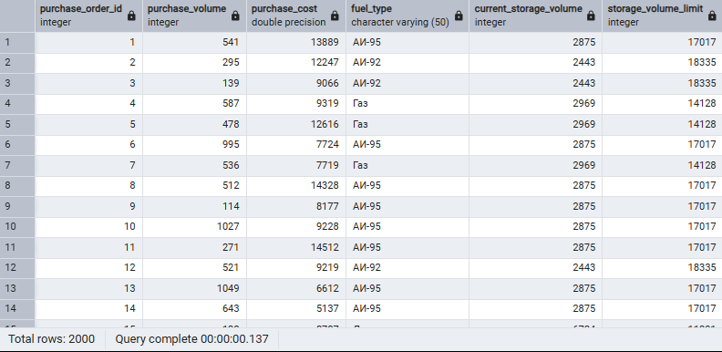
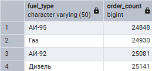
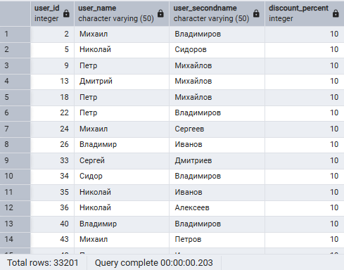
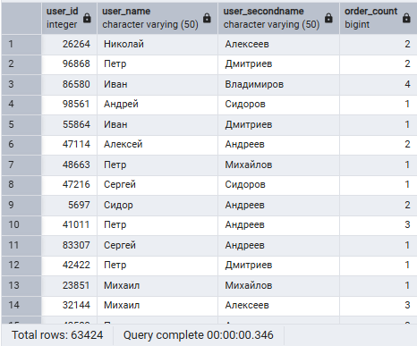
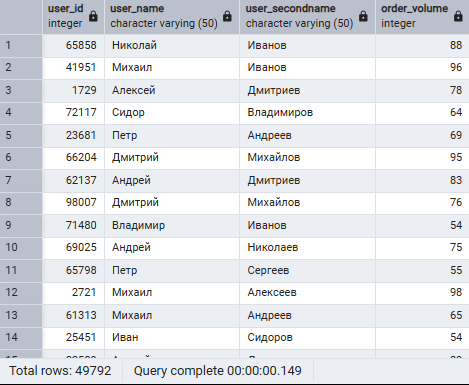

# GAS STATION

## Описание

---
GAS STATION - это база данных (далее БД), которая служит для хранения данных в среде автозаправок.
Автоматизация и хранение большого количества данных способствует упрощению рутинной финансовой и управленческой работы.

---

## Структура БД

Ниже представлено наше представление стурктуры БД:



---

## Тестовые запросы

Ниже представлены тестовые запросы с результатами выполнения, дабы показать какие запросы можно выполнять.

### Запрос 1:

```sql
--Запрос 1 | Выводит записи из таблицы заказов топлива клиентами в правильном отображении
SELECT
    o.id AS order_id,
    o.fuel_dispenser,
    o.volume,
    o.cost,
    u.id AS user_id,
    u.name AS user_name,
    u.secondname AS user_secondname,
    u.thirdname AS user_thirdname,
    u.status AS user_status,
    r.role AS user_role,
    ft.type AS fuel_type,
    fp.price AS fuel_price,
    dc.id AS discount_card_id,
    d.discount AS discount_percent
FROM
    Orders o
JOIN Users u ON o.user_id = u.id
JOIN Roles r ON u.role_id = r.id
JOIN Fuel_type ft ON o.fuel_type_id = ft.id
JOIN Fuel_prices fp ON o.fuel_type_id = fp.fuel_type_id
JOIN Discount_cards dc ON o.discount_card_id = dc.id
JOIN Discounts d ON dc.discount_id = d.id;
```


### Запрос 2:

```sql
-- Запрос 2 | Выводит записи из таблицы поставок топлива в правильном отображении
SELECT
    po.id AS purchase_order_id,
    po.volume AS purchase_volume,
    po.cost AS purchase_cost,
    ft.type AS fuel_type,
    fs.volume AS current_storage_volume,
    fs.volume_limit AS storage_volume_limit
FROM
    Purchase_orders po
JOIN Fuel_type ft ON po.fuel_type_id = ft.id
JOIN Fuel_storage fs ON po.fuel_type_id = fs.fuel_type_id;
```



## Запрос 3:

```sql
-- Запрос 3 | Количество заказов по типам топлива
SELECT
    ft.type AS fuel_type,
    COUNT(o.id) AS order_count
FROM
    Orders o
JOIN Fuel_type ft ON o.fuel_type_id = ft.id
GROUP BY
    ft.type;
```



## Запрос 4:

```sql
-- Запрос 4 | Пользователи с определенной скидкой
SELECT
    u.id AS user_id,
    u.name AS user_name,
    u.secondname AS user_secondname,
    d.discount AS discount_percent
FROM
    Users u
JOIN Discount_cards dc ON u.id = dc.user_id
JOIN Discounts d ON dc.discount_id = d.id
WHERE
    d.discount = 10;
```



## Запрос 5:

```sql
-- Запрос 5 | Количество заказов для каждого пользователя
SELECT
    u.id AS user_id,
    u.name AS user_name,
    u.secondname AS user_secondname,
    COUNT(o.id) AS order_count
FROM
    Users u
JOIN Orders o ON u.id = o.user_id
GROUP BY
    u.id, u.name, u.secondname;
```



## Запрос 6:

```sql
-- Запрос 6 | Пользователи с заказами на определенный объем топлива
SELECT
    u.id AS user_id,
    u.name AS user_name,
    u.secondname AS user_secondname,
    o.volume AS order_volume
FROM
    Users u
JOIN Orders o ON u.id = o.user_id
WHERE
    o.volume > 50;
```



### Примечание
В папке `postgres/data` есть файл `Querys.sql` где есть все запросы в случае если они не отображаются в README.